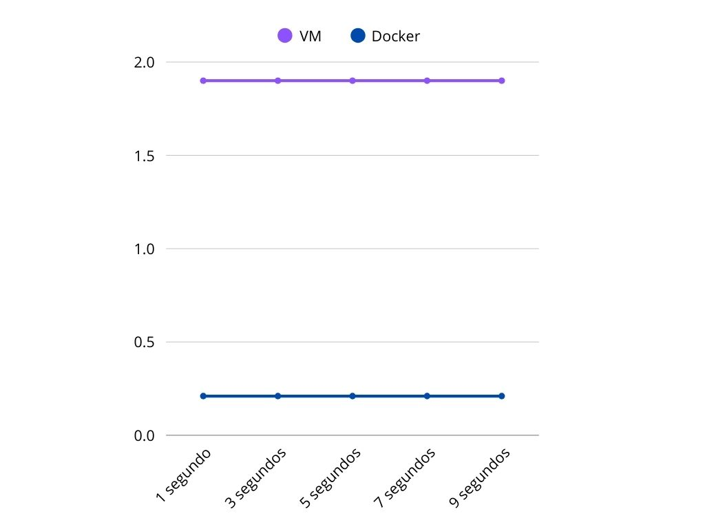

# 🧪 VM vs Docker Benchmark Project

Este proyecto compara el rendimiento de una máquina virtual (VM) y un contenedor Docker ejecutando las mismas pruebas.

## 📊 Métricas

- CPU
- Memoria

## 📂 Estructura

- `doom-docker/`: entorno Docker
- `media/`: archivos multimedia usados

# Método de comparación de rendimiento de Docker y Máquina Virtual
#### Se va a hacer una comparación de rendimiento entre una Máquina Virtual (Ubuntu 22.04) y un sistema Docker (Ubuntu 22.04). Para ello, se ejecutará el videojuego ***DOOM (1993)***.

## Instalación y ejecución
### Instalación y ejecución en Máquina Virtual (VM)
#### Introduciremos los siguientes comandos en la terminal de nuestra VM (en este caso, Ubuntu 22.04):

`sudo apt install chocolate-doom`: instalamos **Chocolate Doom**.

`wget https://distro.ibiblio.org/pub/linux/distributions/slitaz/sources/packages/d/doom1.wad`: Descargamos el archivo `.wad`

`chocolate-doom -iwad ~/doom1.wad`: Ejecutamos el juego.

### Instalación y ejecución en Docker (Ubuntu 22.04)
#### Comenzaremos descargando lo siguiente en la máquina host en el caso de que estemos utilizando Windows.

- **Docker**
- **WSL**, necesario para el funcionamiento del entorno de Linux en el sistema operativo ***Windows 11***.
- **X410**, herramienta que permite ejecutar interfaces gráficas de Linux en Windows.
- **Chocolate Doom**, el motor del juego.

> Importante: Docker y X410 tienen que estar ejécutandose para el funcionamiento del juego. Si alguna de estas no está funcionando aunque sea en segundo plano, el juego no iniciará.

#### Creamos la carpeta `doom-docker`, el archivo `Dockerfile`, el cual he adjuntado, así como el archivo `DOOM.WAD`, que podríamos decir que es el juego en **sí mismo**. 

#### Creamos la imagen de Docker:
`cd C:\Users\NombreUsuario\doom-docker`

`docker build -t chocolate-doom`

#### Ejecutamos el juego:
`docker run -e DISPLAY=host.docker.internal:0 chocolate-doom`

## Comparación de rendimiento
### En Docker 
#### Ejecutaremos el comando `docker stats`, que nos mostrará:
- Uso de CPU %

- Uso de memoria

- Entrada/salida de red

- Entrada/salida de disco

- Métricas en vivo por contenedor

### En VM
#### Ejecutaremos el comando `top` en la terminal de Linux. Esto nos mostrará:
- Uso de CPU %

- Uso de memoria

- Entre otras cosas.

# RESULTADOS

## En VM

## En Docker

## Rendimiento de la CPU

## Rendimiento de la Memoria

# ¿Por qué?
### Podemos observar como, pese a que nuestra máquina virtual consume mucha más CPU y memoria, el juego se ejecuta de forma mucho más fluida a cómo lo hace en un entorno Docker. 

### La razón por la que esto sucede es simple: Docker no está preparado para aplicaciones gráficas, como es un videojuego. Docker ejecuta mucho mejor aplicaciones sin interfaces. En caso de un videojuego, los gráficos se renderizan por software, lo cual es muy lento. Además, el uso de una herramienta como ***X410*** causa mayor latencia.